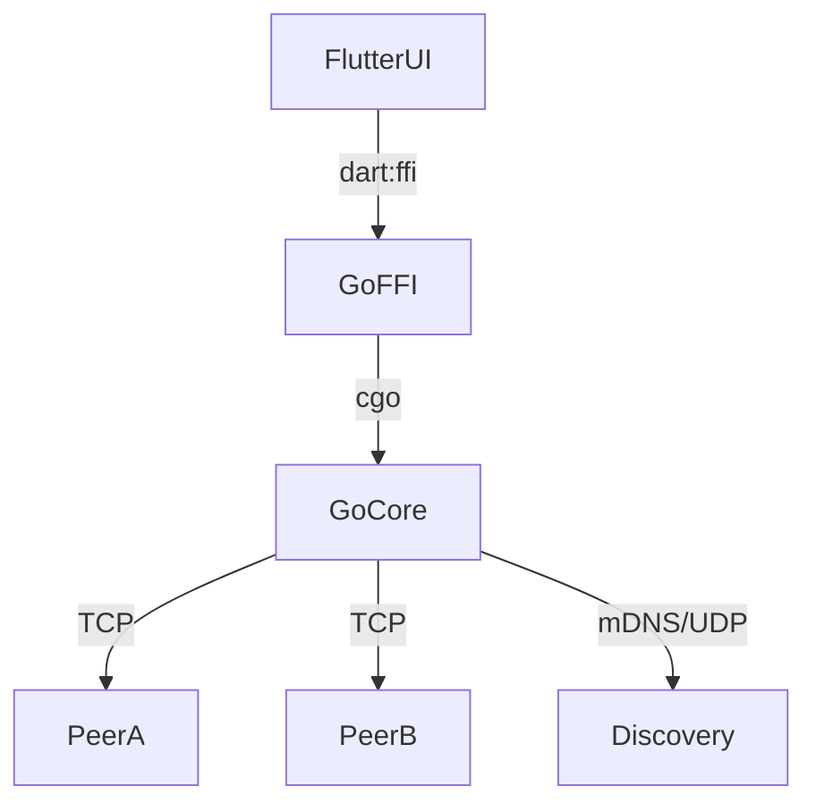

# Piper — план доработок

Дата: 2026-03-06
Текущий счёт: ~72 / 160 баллов
Цель после выполнения плана: ~130–145 / 160 баллов

---

## Текущая оценка по разделам

| Раздел | Макс. | Сейчас | После плана |
|--------|-------|--------|-------------|
| 1. Базовая работоспособность | 20 | 15 | 20 |
| 2. Архитектура сети | 20 | 8 | 18 |
| 3. Real-time звонки | 20 | 9 | 18 |
| 4. Надёжность | 15 | 2 | 12 |
| 5. Передача файлов | 10 | 4 | 9 |
| 6. Документация | 5 | 1 | 5 |
| 7. Безопасность | 10 | 5 | 8 |
| Бонус: Групповые чаты | 10 | 10 | 10 |
| Бонус: Кросс-платформенность | 10 | 10 | 10 |
| Бонус: Красивый UI/UX | 10 | 8 | 8 |
| Бонус: Написанные тесты | 10 | 0 | 8 |
| Бонус: Оптимизация vs аналоги | 10 | 0 | 3 |
| **Итого** | **160** | **~72** | **~129** |

---

## ФАЗА 0 — Быстрые победы (+18 баллов, ~2 часа)

Нет зависимостей, можно сделать параллельно. Максимальная отдача при минимальных усилиях.

### F0-1. README.md (+2 балла)
**Файл:** `README.md` (корень репозитория)

Написать README с разделами:
- Что такое Piper, цель проекта
- Архитектура (кратко: Go core + Flutter + WebRTC)
- Требования и сборка (Android, Windows)
- Запуск: TUI (`go run ./go/cmd/piper`) и Flutter-приложение
- Используемые технологии и обоснование выбора стека

### F0-2. Архитектурная схема (+2 балла)
**Файл:** `docs/ARCHITECTURE.md`

Нарисовать Mermaid-диаграммы:
1. Компонентная схема (Flutter UI → dart:ffi → Go core → TCP/mDNS)
2. Схема топологии (до и после mesh): было flat P2P, стало relay chain
3. Схема handshake: Hello → ECDH → SharedKey



### F0-3. Дедупликация текстовых сообщений (+4 балла)
**Файл:** `go/core/node.go`

Добавить `seenMsgIDs sync.Map` в структуру `Node`. В `handleMessage()` перед обработкой любого сообщения проверять `msg.ID` в кеше. Если уже видели — пропустить. Очистка кеша по TTL (30 минут) через `time.AfterFunc`.

```go
// В Node:
seenMsgIDs sync.Map // msgID -> time.Time

// В handleMessage():
if _, loaded := n.seenMsgIDs.LoadOrStore(msg.ID, time.Now()); loaded {
    return // дедупликация
}
```

### F0-4. Методика замеров Real-time (+6 баллов)
**Файл:** `flutter-app/lib/services/call_service.dart`

Добавить сбор WebRTC-статистики через `RTCPeerConnection.getStats()` каждые 2 секунды во время звонка. Отображать в UI:
- RTT (round-trip time) в мс
- Jitter в мс
- Packet loss %
- Bitrate (audio/video)

```dart
// В _CallSession:
Timer? _statsTimer;
Map<String, dynamic> callMetrics = {};

void _startStatsCollection(RTCPeerConnection pc) {
  _statsTimer = Timer.periodic(Duration(seconds: 2), (_) async {
    final stats = await pc.getStats();
    // Парсить inbound-rtp: jitter, packetsLost, roundTripTime
  });
}
```

Метрики логировать через `LogService` и показывать в `CallScreen` (маленький оверлей или в деталях звонка).

### F0-5. Исправление Path Traversal (безопасность, +1 балл)
**Файл:** `go/core/node.go:1025`, `flutter-app/lib/services/piper_service.dart:269`

```go
// Go: санитизировать имя файла
safeName := filepath.Base(msg.FileName)
if safeName == "." || safeName == ".." || safeName == "" {
    safeName = "received_file"
}
destPath := filepath.Join(n.downloadsDir, safeName)
```

```dart
// Dart: то же самое
final safeName = path.basename(e.fileName ?? 'received_file');
final filePath = '$_downloadsDir${Platform.pathSeparator}$safeName';
```

---

## ФАЗА 1 — Mesh-сеть (мультихоп + маршрутизация) (+16 баллов, ~6 часов)

Это ключевая фаза. Реализует мультихоп-цепочку через flood routing с TTL и дедупликацией. Даёт баллы за пункты 1 (мультихоп) и 2 (маршрутизация, дедупликация, петли).

### Архитектурное решение: Flood Routing с TTL

**Почему flood, а не distance-vector:**
- Для демо с 3–5 узлами flood достаточен
- Реализуется за несколько часов (vs несколько дней для DV)
- TTL=3 ограничивает нагрузку
- Дедупликация по msgID предотвращает петли
- ТЗ требует "продемонстрировать мультихоп-цепочку" — flood это выполняет

### F1-1. Расширить протокол Message (+TTL и HopPath)
**Файл:** `go/core/message.go`

```go
// Добавить поля в Message:
TTL     int      `json:"ttl,omitempty"`      // осталось хопов (макс 5)
Origin  string   `json:"origin,omitempty"`   // исходный отправитель (для relay)
HopPath []string `json:"hop_path,omitempty"` // список peerID по пути (для диагностики)
```

Добавить новый тип:
```go
MsgTypeRelay MsgType = "relay" // обёртка для пересылки через ретранслятор
```

Relay-сообщение:
- `To` = конечный получатель
- `Origin` = источник
- `Content` = оригинальный зашифрованный payload
- `TTL` = оставшиеся хопы (уменьшается при каждой пересылке)
- `HopPath` = путь (добавляется каждым ретранслятором)

### F1-2. Таблица маршрутизации в Node
**Файл:** `go/core/node.go`

Добавить простую routing table — маппинг "кому можно достучаться через кого":

```go
// В Node:
routeMu    sync.RWMutex
routeTable map[string]string // targetPeerID -> nextHopPeerID (прямое соединение)
```

При получении Hello от пира A через соединение с B:
- `routeTable[A] = B` (A доступен через B как next hop)

При получении любого сообщения: обновлять routeTable на основе `msg.PeerID` и `msg.HopPath`.

### F1-3. Логика пересылки (relay forwarding)
**Файл:** `go/core/node.go`

В `handleMessage()` после дедупликации F0-3 добавить:

```go
func (n *Node) maybeForward(msg Message, sourcePeerID string) {
    if msg.TTL <= 0 {
        return // TTL исчерпан
    }
    if msg.To != "" && msg.To != n.id {
        // Unicast relay: знаем маршрут — шлём напрямую; нет — флудим
        msg.TTL--
        msg.HopPath = append(msg.HopPath, n.id)

        n.routeMu.RLock()
        nextHop, known := n.routeTable[msg.To]
        n.routeMu.RUnlock()

        if known {
            n.sendToPeer(nextHop, msg)
        } else {
            n.floodExcept(msg, sourcePeerID)
        }
        return
    }
    if msg.To == "" {
        // Broadcast relay: флудим всем кроме источника
        msg.TTL--
        msg.HopPath = append(msg.HopPath, n.id)
        n.floodExcept(msg, sourcePeerID)
    }
}

func (n *Node) floodExcept(msg Message, excludePeerID string) {
    n.mu.Lock()
    conns := make([]*conn, 0, len(n.connByPeerID))
    for pid, cn := range n.connByPeerID {
        if pid != excludePeerID {
            conns = append(conns, cn)
        }
    }
    n.mu.Unlock()
    for _, cn := range conns {
        cn.send(msg)
    }
}
```

### F1-4. Установить TTL при отправке
**Файл:** `go/core/node.go`

При создании исходящего сообщения (NewTextMessage, NewDirectMessage и т.д.) устанавливать TTL=5, Origin=n.id.

```go
func (n *Node) Send(text, toPeerID string) {
    msg := NewTextMessage(n.id, n.name, text)
    msg.TTL = 5
    msg.Origin = n.id
    // ... остальная логика
}
```

### F1-5. Обновление routeTable при получении сообщений
**Файл:** `go/core/node.go`

```go
func (n *Node) updateRouteTable(msg Message, viaConn string) {
    if msg.Origin != "" && msg.Origin != n.id {
        n.routeMu.Lock()
        // Если знаем только через ретранслятора — записываем
        if _, exists := n.routeTable[msg.Origin]; !exists {
            n.routeTable[msg.Origin] = viaConn
        }
        n.routeMu.Unlock()
    }
}
```

### F1-6. Демо мультихопа в TUI/Flutter
**Файлы:** `go/tui/model.go`, `flutter-app/lib/screens/`

- В TUI: команда `/route` для вывода routing table
- В TUI: при relay-сообщении показывать `[relay via X]` в чате
- В Flutter: показывать hop path в деталях сообщения (опционально)
- Логировать: `[relay] forwarded msg <id> to <peer> (TTL=N, path=[A→B→C])`

---

## ФАЗА 2 — Надёжность (+10 баллов, ~5 часов)

### F2-1. Ack для текстовых сообщений (+5 баллов)
**Файл:** `go/core/node.go`, `go/core/message.go`

Добавить тип `MsgTypeAck`:
```go
MsgTypeAck MsgType = "ack" // подтверждение доставки
```

Структура Ack:
```go
// В Message: использовать Content = ackID (ID подтверждаемого сообщения)
```

В Node:
```go
pendingAcks   sync.Map // msgID -> *pendingAck
```

```go
type pendingAck struct {
    msg       Message
    toPeerID  string
    deadline  time.Time
    attempts  int
}
```

После отправки прямого/группового сообщения — ставить в `pendingAcks`. При получении Ack — удалять. По таймеру (каждые 2с) — перепосылать если `attempts < 3`. Через 3 попытки — эмитить событие `DeliveryFailed`.

### F2-2. Rate limiting для файловых чанков (+3 балла)
**Файл:** `go/core/transfer.go`

Заменить `time.Sleep(0)` на token bucket или простую скоростную задержку:

```go
const maxChunkBytesPerSec = 512 * 1024 // 512 KB/s

// В streamFileChunks():
startTime := time.Now()
bytesSent := 0

// После каждого отправленного чанка:
bytesSent += len(chunkData)
elapsed := time.Since(startTime).Seconds()
expectedTime := float64(bytesSent) / maxChunkBytesPerSec
if expectedTime > elapsed {
    time.Sleep(time.Duration((expectedTime - elapsed) * float64(time.Second)))
}
```

Это даст файлам ~512 KB/s потолок, не убивая канал для сообщений и звонков.

### F2-3. Очередь сообщений при разрыве (+2 балла)
**Файл:** `go/core/node.go`

Добавить простую очередь недоставленных сообщений на случай разрыва:

```go
// В Node:
offlineQueue   map[string][]Message // peerID -> очередь сообщений
offlineQueueMu sync.Mutex
```

При `conn.send()` с ошибкой — класть сообщение в очередь. При `PeerJoined` — флашить очередь.

---

## ФАЗА 3 — Передача файлов: Resume (+3 балла, ~3 часа)

### F3-1. Сохранение прогресса передачи
**Файл:** `go/core/transfer.go`, `go/core/message.go`

Добавить поле в FileOffer/FileAccept:
```go
ResumeOffset int64 `json:"resume_offset,omitempty"` // с какого байта продолжать
```

На стороне получателя:
- Проверять наличие partial-файла `<transferID>.part` в downloadsDir
- Если файл существует и размер совпадает с ранее полученным — отправить FileAccept с ResumeOffset
- Дописывать чанки в файл с правильным offset

На стороне отправителя:
- Если FileAccept содержит ResumeOffset > 0 — начинать с этого чанка (пропускать первые N чанков)

При завершении: переименовать `<transferID>.part` в оригинальное имя файла.

---

## ФАЗА 4 — Тесты (+8 баллов бонус, ~5 часов)

### F4-1. Unit-тесты Go core
**Файл:** `go/core/*_test.go`

Написать тесты:
- `message_test.go`: сериализация/десериализация Message, ReadMsg/WriteMsg round-trip
- `peer_test.go`: PeerManager Upsert/Get/List thread safety (race detector)
- `group_test.go`: GroupManager Create/AddMember/RemoveMember
- `crypto_test.go`: GenerateKeyPair, Encrypt/Decrypt round-trip
- `node_test.go`:
  - TestNodeStartStop — Start() + Stop() без паники
  - TestNodePeerDedup — дедупликация сообщений по ID
  - TestNodeRelay — 3-узловая цепочка A→B→C, A шлёт сообщение C через B

```go
// Пример TestNodeRelay:
func TestNodeRelay(t *testing.T) {
    a := NewNode("Alice")
    b := NewNode("Bob")
    c := NewNode("Charlie")
    // Запустить на localhost:0
    // Подключить a→b, b→c (a не видит c напрямую)
    // Отправить сообщение от a к c
    // Убедиться что c получил с HopPath содержащим b
}
```

### F4-2. Go тесты отказов
**Файл:** `go/core/node_failure_test.go`

- `TestDisconnect`: a→b→c, разрываем b, проверяем что a и c получили PeerLeft
- `TestReconnect`: после разрыва discovery переустанавливает соединение
- `TestRelayFallback`: при отключении прямого пира, сообщения идут через relay

### F4-3. Flutter widget tests
**Файл:** `flutter-app/test/`

Базовые тесты:
- `call_service_test.dart`: mock WebRTC, тест state machine (idle → calling → active → idle)
- `piper_service_test.dart`: тест парсинга событий через PiperEvent.fromJson

---

## ФАЗА 5 — Документация и безопасность (+4 балла, ~2 часа)

### F5-1. Модель угроз
**Файл:** `docs/SECURITY.md` или раздел в README

Написать краткую модель угроз:
- **Защищаемся от:** пассивного перехвата трафика → X25519+ChaCha20
- **Не защищаемся от:** активного MITM без PKI (known limitation)
- **Спуфинг глобального чата:** известная проблема, пометить в UI как "незащищённый канал"
- Описать что глобальный чат plaintext намеренно

### F5-2. Подпись PeerID публичным ключом (+3 балла, опционально)
**Файл:** `go/core/crypto.go`, `go/core/node.go`

Долгосрочная идентификация через Ed25519:
- Генерировать Ed25519 keypair при первом запуске, сохранять в файл `~/.piper/identity`
- В Hello-сообщение добавить `IdentityPubKey []byte` и `IDSignature []byte` (подпись PeerID)
- При получении Hello — верифицировать подпись: `ed25519.Verify(identityPubKey, []byte(peerID), idSignature)`
- PeerID = hex(SHA256(identityPubKey[:16])) — детерминировано из ключа

---

## Порядок выполнения (рекомендуемый)

```
День 1 (4 часа):
  [F0-1] README.md                    — 30 мин
  [F0-2] Архитектурная схема          — 30 мин
  [F0-3] Дедупликация сообщений       — 30 мин
  [F0-5] Fix path traversal           — 20 мин
  [F1-1] Протокол: TTL + HopPath      — 30 мин
  [F1-2] Routing table в Node         — 45 мин
  [F1-3] Flood relay logic            — 60 мин
  [F1-4] TTL при отправке             — 15 мин
  [F1-5] updateRouteTable             — 20 мин

День 2 (4 часа):
  [F1-6] TUI/Flutter демо relay       — 60 мин
  [F0-4] WebRTC stats + UI метрики    — 90 мин
  [F2-1] Ack для сообщений            — 90 мин

День 3 (4 часа):
  [F2-2] Rate limiting файлов         — 45 мин
  [F2-3] Offline queue                — 60 мин
  [F3-1] File resume                  — 90 мин
  [F5-1] Модель угроз                 — 45 мин

День 4 (4 часа):
  [F4-1] Go unit тесты                — 120 мин
  [F4-2] Go failure тесты             — 90 мин
  [F4-3] Flutter тесты                — 30 мин
```

---

## Что НЕ делаем (и почему)

| Фича | Причина пропуска |
|------|-----------------|
| BLE/WiFi Direct | Требует нативного Android кода (Java/Kotlin), сложно интегрировать в 3-4 дня |
| STUN/TURN NAT traversal | Противоречит концепции полной децентрализации; сложность высокая |
| Distance-vector routing | Flood routing достаточен для демо, DV — неделя работы |
| Ed25519 PKI (F5-2) | Опционально; делать только если есть время после всего остального |
| Бенчмарки vs аналоги | Требует настройки аналогов (Signal, Matrix) и стенда — нецелесообразно |

---

## Ключевые файлы для изменений

| Файл | Что добавить |
|------|-------------|
| `go/core/message.go` | TTL, Origin, HopPath, MsgTypeAck, MsgTypeRelay |
| `go/core/node.go` | seenMsgIDs, routeTable, maybeForward(), floodExcept(), pendingAcks, offlineQueue |
| `go/core/transfer.go` | rate limiting, ResumeOffset |
| `flutter-app/lib/services/call_service.dart` | getStats() polling, метрики RTT/jitter/loss |
| `flutter-app/lib/screens/call_screen.dart` | Отображение метрик звонка |
| `go/tui/model.go` | Показ relay path, команда /route |
| `README.md` | Создать с нуля |
| `docs/ARCHITECTURE.md` | Mermaid-диаграммы |
| `go/core/*_test.go` | Все тесты |
